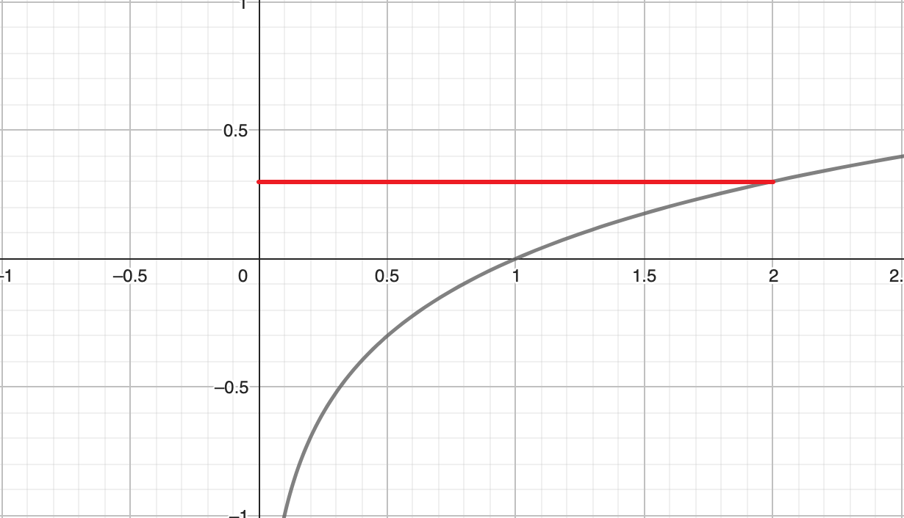
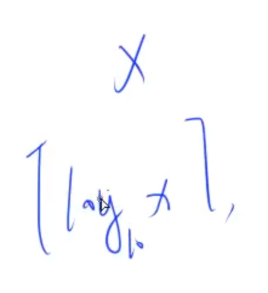
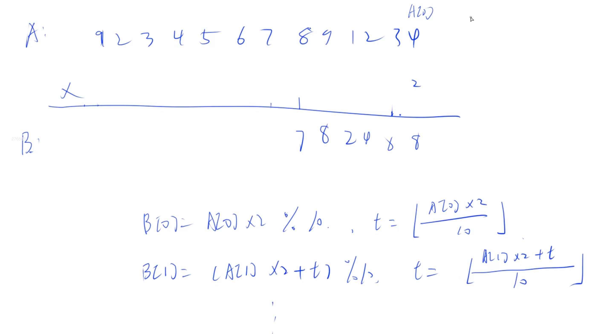

### 求 2^N (n <= 10000) 的位数

log_10(2^n) = n * log_10(2) = n * 0.30 = 3000




求 X 的位数：



### 高精度运算：数组存大数

小端存储。

| 0    | 1    | 2    | 3    | 4    | 5    | 6    |
| ---- | ---- | ---- | ---- | ---- | ---- | ---- |
| 个   | 十   | 百   | 千   | 万   | 十万 | 百万 |



### memset
```cpp
#include <cstring> // => memset
// memset(array_name, init_value, length);
// length unit: bit || sizeof
```


- :ballot_box_with_check: [Copying data using the memset() function in C](https://www.educative.io/answers/copying-data-using-the-memset-function-in-c) To Read

### memcpy
```cpp
memcpy(destination, source, length_by_bit)
```

# ？

- 补码
